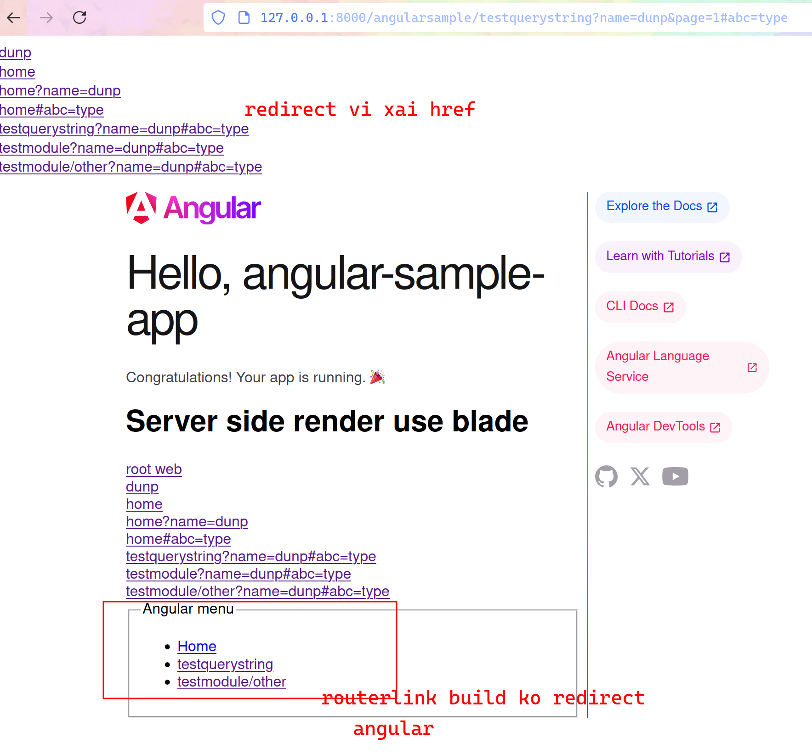

# angular run as sub folder with the same domain to web api and blade render

after build angular we copy to public/angularsample. some config bellow will do this automaticlly

# laravel-with-angular

php artisan serve

## handle 404 example-app/app/Exceptions/Handler.php

add function

`
   
          public function render($request, Throwable $exception)
          {
              if ($exception instanceof NotFoundHttpException) {
                  $path = urlencode($request->fullUrl());
                  $needle = urlencode("/angularsample/");
                  if (stripos($path, $needle) > 0) {
                      //If a 404 exception is encountered, serve the Angular index.html

                      return response()->file(public_path('angularsample/index.html'));
                  }
              }

              //Handle other routes

              return parent::render($request, $exception);
          }
`

## route url example-app/routes/web.php

          `

          // Serve Angular static files directly (CSS, JS, images, etc.)
          Route::get('angularsample/{any}', function ($any) {
              $filePath = public_path('angularsample/' . $any);
              if (file_exists($filePath)) {
                  return response()->file($filePath);
              }
              return file_get_contents(public_path('angularsample/index.html'));
          })->where('any', '.*');

          // Fallback route to serve Angular's index.html
          Route::get('angularsample/{any}', function () {
              return file_get_contents(public_path('angularsample/index.html'));
          })->where('any', '.*');

          // Fallback route to serve Angular's index.html
          Route::get('/angularsample', function () {
              return file_get_contents(public_path('angularsample/index.html'));
          });

`

# angular

ng serve

## ng build 

assum satic file angular built copy to laravel folder public/angularsample

angular.json

                "options": 
                    {
                        //"outputPath": "dist/angular-sample-app",
                        "outputPath":{"base":"../example-app/public/angularsample",
                        "browser": ""  ,
                        "baseHref": "/angularsample/"
                    },

ng build have change in index.html or src/index.html angular

                    <base href="/angularsample/">

      `
      <!doctype html>
      <html lang="en">
      <head>
        <base href="/angularsample/">
        <meta charset="utf-8">
        <title>AngularSampleApp</title>
        <meta name="viewport" content="width=device-width, initial-scale=1">
        <link rel="icon" type="image/x-icon" href="favicon.ico">
      </head>
      <body>
        <app-root></app-root>
      </body>
      </html>

`

# ng serve
            

First, create a proxy.conf.json file in your Angular project root:

`
          {
            "/angularsample": {
              "target": "http://localhost:4200",
              "secure": false,
              "pathRewrite": {
                "^/angularsample": ""
              },
              "changeOrigin": true,
              "logLevel": "debug"
            }
          }
`

## Update your angular.json to include the proxy configuration:

`
          {
            "projects": {
              "your-project-name": {
                "architect": {
                  "serve": {
                    "options": {
                      "proxyConfig": "proxy.conf.json"
                    }
                  }
                }
              }
            }
          }

`

